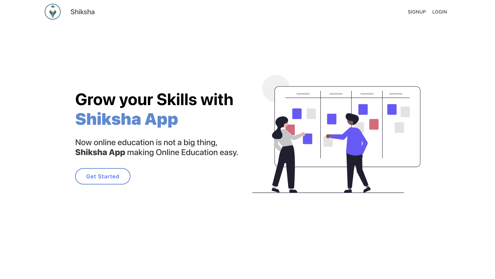
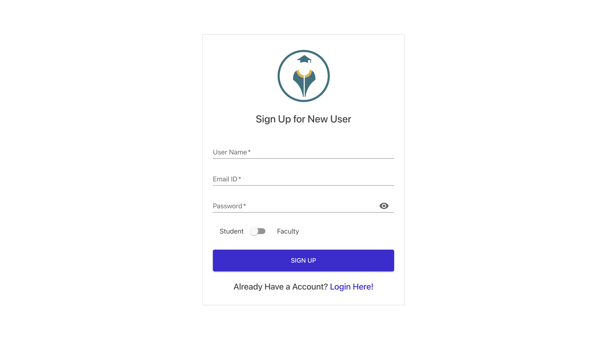
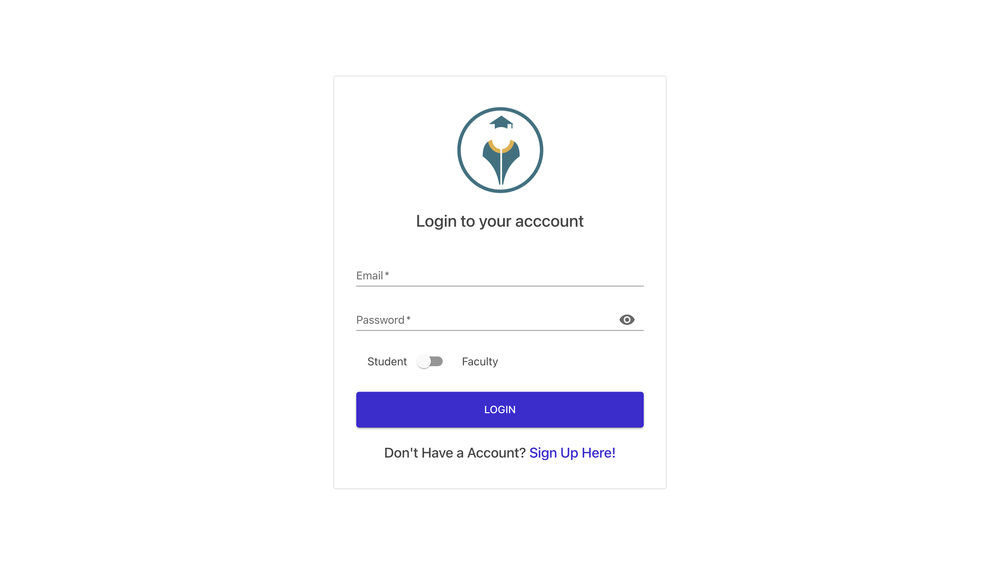
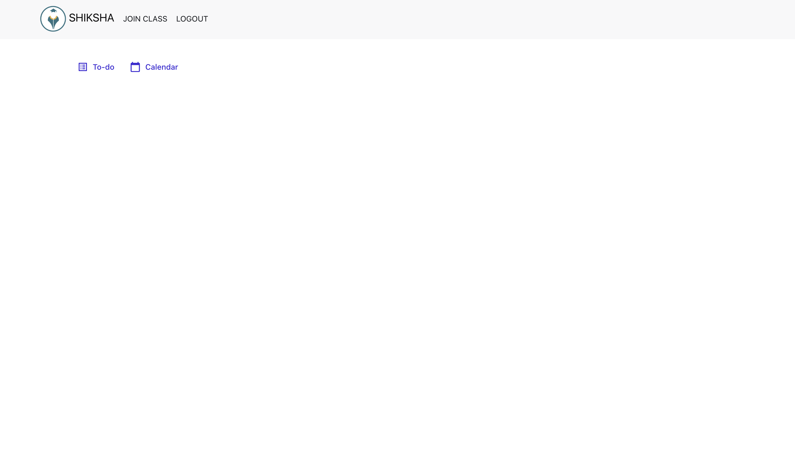

# Shiksha App

### A Real-world application for a better interaction between students and teacher to make education simpler.

## Deployment
[Live Link](https://mynotes-afroz.herokuapp.com/)

## Features
- Developed a Web Application that allows smooth interaction between Students and Teachers in Online Education.
- Added various features, including creating classrooms, joining a subject, posting assignments, scheduling classes, and assigning marks that can be seen by a particular student.
- Designed UI using ReactJs and Material UI, server using NodeJs, ExpressJs, and MongoDB as a Database service.

## Objectives

- One Safe place for all your notes.

## Home page

## SignUp Page

## LogIn Page

## Student Dashboard (After LogIn)

<!-- ## Faculty Dashboard (After LogIn)

## Created ClassRoom

 -->

## Technologies Details

### Backend Technologies

- Node, Express

### Frontend Technologies

- ReactJs, Material Ui, Redux

### Database

- MongoDB, mongooose

## Setup

- create .env file in root directory \
`MONGO_URI="YOUR MONGO_URI"` \
`NODE_ENV`="PRODUCTION/DEVELOPMENT" \
`PORT`=8800 

- client side \
 Go to frontend directory and run `npm i && npm start` command.
- server side\
 Go to root directory and run `npm i && npm start` command.
